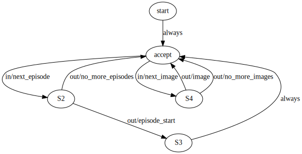

# AIDO Nodes Protocol {#part:aido-protocol status=ready}


This document describes the rationale and design for the AIDO protocol.

<div id="toc"></div>


# Goals and non-goals {status=ready}

## Goals

### Long shelf life

We want to obtain a library of modules that have a long "shelf life".

For example, it should be easy to run "the line detector from 2018" in 2021.


This also suggests that modules should be independent of middle-ware as much as possible.


### Flexibility

It should be possible to easily use a module in at least these scenarios:

* On the robot in real-time.
* Called as part of other modules ("module decorator").
* In a simulation, with the simulator both local (same host) or remote.
* In "batch mode", where the data is supplied from logs. 

It should be possible to run two instances of the same module / system on the same host.

### Deterministic replay

It should be possible to apply the same module to the same data and obtain the same output. 

Example violation: current Slimremote protocol runs simulation while it "waits" for the connection from the client.
The result is then dependent on the network status.

### Deterministic uncertainty. 

There should be a clear way for modules to access a seed to use for their random number generators.

### Protocol checks

It should be explicit what protocol a module uses, and it should be easy to check to avoid incompatibilities. 

Example: Understanding whether I can pipe `p1` into `p2`.

### Resource limitation

Should be possible to give hard constraints on memory/cpu for each node.

### Protocol extendability

The protocols should support a notion of extension; so that we can say that not only `p1` is different from `p2`, but also that any agent using `p1` would work with `p2`.


### Meta information

Nice to have some meta information in the module (who wrote, the description, etc.)

## Non-goals {status=ready}

### Ultimate speed. 

We are OK in accepting a performance hit.

(Note: did you know it takes 20ms to deserialize the line segment messages with ROS?)

## Why ROS is not a solution

"Using ROS" is not a solution, due to the following problems.

### Network trouble

ROS insists on having two processes need to know the other hosts not only by IP, but also by hostname. This causes a bunch of problems.

### Incompatibility

ROS 1 does not allow Python 3.

### Non-compositionality

It is not possible to run two ROS independent instances of a system on the same machine.


# AIDO Nodes {status=ready}

## Overview

We go back to the UNIX philosophy. "AIDO Nodes" or simply "nodes" are executable that read and write to `stdin` and `stdout`.

The nodes are likely packaged in a Docker container. From our point of view, it does not matter whether
we are running a naked executable or a containerized executable. In either case, there will be
 a standard input / standard output to write to.   

The data that is moved across these sockets is encoded as JSON-L: each line is a well-formed JSON message. 
JSON also allows to add binary data, encoded as a base64 string. 

AIDO Nodes interact according to well-defined protocols that are formally specified.
There are two levels of formalization:

1. Describe which messages are valid messages. For this, we use JSON Schema.
2. Describe what is a valid interaction or sequence of messages. For this, we use a regular language.


## Individual JSON messages

The messages are of the form: 

```json
{"topic": ![topic name], "data": ![data]}
```

A newline delimiter separates the JSON messages.

The "topic name" has the same semantics as in ROS: while there is only one pipe for stdin/stdout,
there are different logical streams of data that are labeled with a topic name. 

## Formalizing the protocol 

To define a protocol, we need to specify: 

1. What are the input and output channels.
2. For each channel, what is the data format.
3. What valid sequence of messages are accepted.


Examples:

*   An agent of type P1 accepts a sequence of images and outputs a series of commands ("left", "right" velocity signals).
*   An agent of type P2 accepts intrinsic and extrinsic image calibration data followed a sequence of images and outputs a series of commands ("left", "right" velocity signals).
*   An agent of type P3  accepts intrinsic and extrinsic image calibration data, a kinematic calibration file, followed a sequence of images and outputs a series of commands ("left", "right" PWM signals).
*   An agent of type P4  accepts extrinsic image calibration data, a kinematic calibration file, followed a sequence of *rectified* images and outputs a series of commands ("left", "right" PWM signals).

All of these are slighly different and failure of distinguishing between those caused much pain.

Note that once we have these formalized, we can also do automatic conversion of protocols. ("If you have an agent of type P1, you can create an agent of type P2 by..."".)

## Language describing the interaction

One way to formalize the interaction protocols are via regular languages.

We use this syntax:

* Define `in:![channel]` as denoting the event "a message was received on channel `![channel]`".
* Define `out:![channel]` as denoting the event "a message was produced on channel `![channel]`".
* Define `L*` as "Zero or more repetitions of `L`".
* Define `L?` as "Zero or one repetitions of `L`".
* Define `L+` as "One or more repetitions of `L`".
* Define `A;B;C` as "`A` followed by `B` followed by `C`"
* Define `A|B|C` as "either `A` or  `B` or `C`"


For example, consider the following protocol:

"An agent that follows the protocol `LaneFilter` accepts one CameraCalibration message on the channel  `calibration`, followed by any number of images on the channel `image`, and to each image it will reply with a pose estimate on channel `estimate`."

As a formal language this can be written as:

```
LaneFilterLanguage := in:calibration (in:image ; out:estimate)*
``` 

This is then a formal description of the protocol; not only the data format, but also of the behavior of the component.

## User APIs

Much of the complexity is hidden for the user.


### Defining protocols using `InteractionProtocol`


Use the class `InterctionProtocol`. See `aido_nodes.protocols` for the currently defined protocols.

Here is an example:

```python
from zuper_nodes import InteractionProtocol
from aido_schemas import JPGImage

protocol_image_filter = InteractionProtocol(
        description="""Takes an image, returns an image.""",
        inputs={"image": JPGImage},
        outputs={"transformed": JPGImage},
        language=" (in:image ; out:transformed)*"
)
```

Above, `JPGImage` is a regular Python dataclass. The JSON schema description
will be generated from the Python dataclass annotations. 

### Creating nodes that follow the protocol

There is an API that allows to easily create a node that follows the protocol while hiding all the complexity of
JSON decoding/encoding. 


A minimal "image filter" can be realized as follows:

```python
from aido_schemas import JPGImage, protocol_image_filter, wrap_direct

class DummyFilter:

    protocol = protocol_image_filter
    
    def on_received_image(self, context, data: JPGImage):
        transformed = data # compute here
        context.write("transformed", transformed)

if __name__ == '__main__':
    node = DummyFilter()
    wrap_direct(node=node, protocol=node.protocol)
```

The user must implement for each input channel `![channel name]` the  function `on_received_![channel name]`. 

This function will be called with parameters `data`, containing the data received (already translated from
JSON), and an object `context`. The object `context` provides the methods:

```python
# write to the given output channel
context.write('channel', data)

# log something
context.log('log string')
``` 

If the node implements it, the API will also call the function `init()` at the beginning
and `finish()` at the end. 


### Guarantees
    
The node can assume that the sequence of calls will respect the protocol.
For example, if the protocol is:

```in:calibration ; (in:image ; out:estimate)```

the node can assume that there is going to be a call to `on_received_calibration` before 
any call to `on_received_image`.

On the other hand, note that the node itself must respect the protocol that has been declared.


## Dockerization examples


See the folder `minimal` in this repository for the minimal implementation
of the protocols so far defined.


## Extra features: configuration handling 

If the node has an attribute called `config`, then the API automatically exposes that configuration.

For example, suppose the node is the following:

```python
from aido_nodes import protocol_image_filter, JPGImage

class MyConfig:
    num_frames: int = 3 

class MyFilter:
    config: MyConfig = MyConfig()
    
    protocol = protocol_image_filter
    
    def on_received_image(self, context, data: JPGImage):
        ...
        
    def on_updated_config(self, context, key, value):
        context.log(f'Config was updated: {key} = {value!r}')
    
```

Then the node will also respond to "control" messages in the channel "`wrapper.set_config`" of the form: 

```json
{"topic": "wrapper.set_config",  "data": {"key":  "![config key]", "value": ![config value]}}
```

For example, in this case we can send a message like:

```json
{"topic": "wrapper.set_config",   "data": {"key":  "num_frames", "value": 2}}
```

The API will automatically update the field `node.config.num_frames`. Then it will call (if defined)
the function `on_updated_config()`; useful if something needs to be re-initialized.

## More complicated example of language

Consider the protocol called `aido_nodes.protocol_image_source`:

```python
protocol_image_source = InteractionProtocol(
        inputs={"next_image": type(None), # ask for the next image
                "next_episode": type(None)}, # ask for the next episode
        outputs={"image": JPGImage, # the output data
                 "episode_start": EpisodeStart, # marks the start of episode
                 "no_more_images": type(None), 
                 "no_more_episodes": type(None)},
        interaction=parse_language("""
                (
                    in:next_episode ; (
                        out:no_more_episodes | 
                        (out:episode_start ;
                            (in:next_image ; (out:image | out:no_more_images))*)
                    )
                )*            
            """),
)
```

`type(None)` means that those messages do not carry any payload. 

The informal description is:


1) First, the node expects to receive a `next_episode` message to start the episode.
2) To this, it can respond either with `no_more_episodes` or `episode_start`.
3) Then it will expect messages `next_image` to which it will reply either with an `image` or with `no_more_images`.


<!--
The nondeterministic finite automaton for the language is parsed as in [](#example_language1):

<figure id='example_language1'>
    
    <figcaption>
    In this diagram, "always" corresponds to an automatic transition.
    </figcaption>
</figure>

 
-->


## Gains from formal definition {status=beta} 

We can then use the usual machinery of the field of formal languages to reason about composition and extendability.

### Extending interaction protocol

For example, we can describe backward-compatibility extensions of protocols.

Imagine that there is a lane filter who can also accept IMU data. But not always it will provide an updated pose from the IMU data.

Its language would be:

``` 
LaneFilterLanguage2 := in:calibration ( (in:image out:estimate) | (in:IMU out:estimate? ))*
```

It is possible (with some assumptions) to reason that LaneFilterLanguage1 is a sublanguage of LaneFilterLanguage2, so that an aidonode that implements the second can be used where the first would be used.

### Extending messages

Another possibility is where the data type is extended.

Already from JSON schema we have a notion of partial order. 

For example imagine a message with two fields:

```json
{"field1": ..., "field2": ...}
```

Adding a field should be a backward compatible change (we did this a few times with AIDO).

```json
{"field1": ..., "field2": ..., "extra_field": ...}
```

Here is how it looks like in JSON Schema.

Note that JSON Schema also allows defining various constraints (apart from the type, also minimum/maximum values etc.)

The first schema is:

```json
{
	"title": "Message v1",
	"description": "First version of the messages",
	"type": "object",
	"fields": {
        "field1": {
            "type": "integer",
            "exclusiveMinimum": 0,
        },
        "field2": {
            "type": "string"
        }
	}
}
```

The second schema is:

```json
{
	"title": "Message v1",
	"description": "First version of the messages",
	"type": "object",
	"fields": {
        "field1": {
            "type": "integer",
            "exclusiveMinimum": 0,
        },
        "field2": {
            "type": "string"
        },
        "extra_field": {
            "type": "string"
        }
	}
}
```


## More detailed architecture {status=draft}

### ROS wrapper

<figure id="fig:wrapper">

</figure>

### Batch processing

<figure id="fig:batch">

</figure>

<style>
img { max-width: 100%; }
</style>


